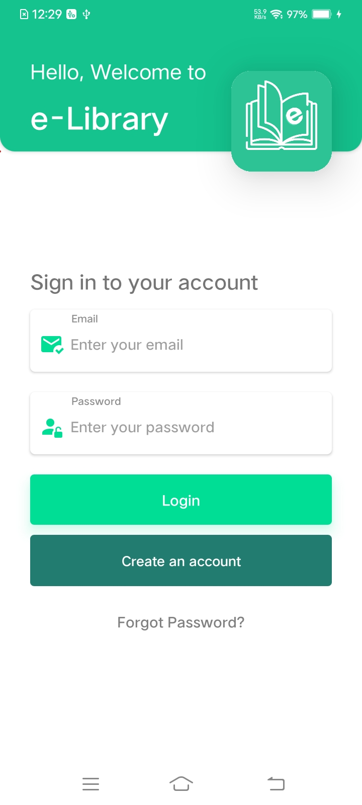
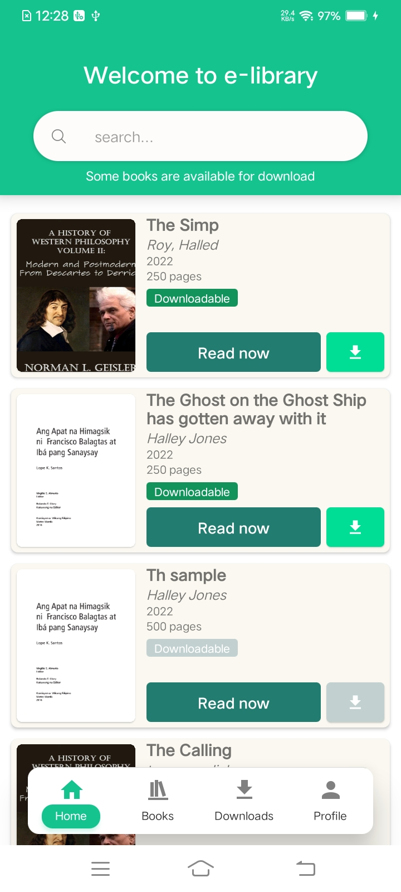
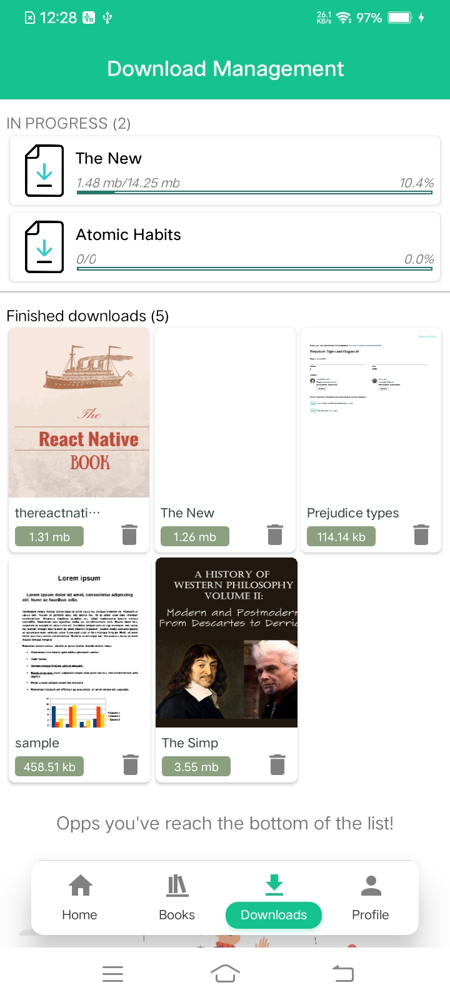
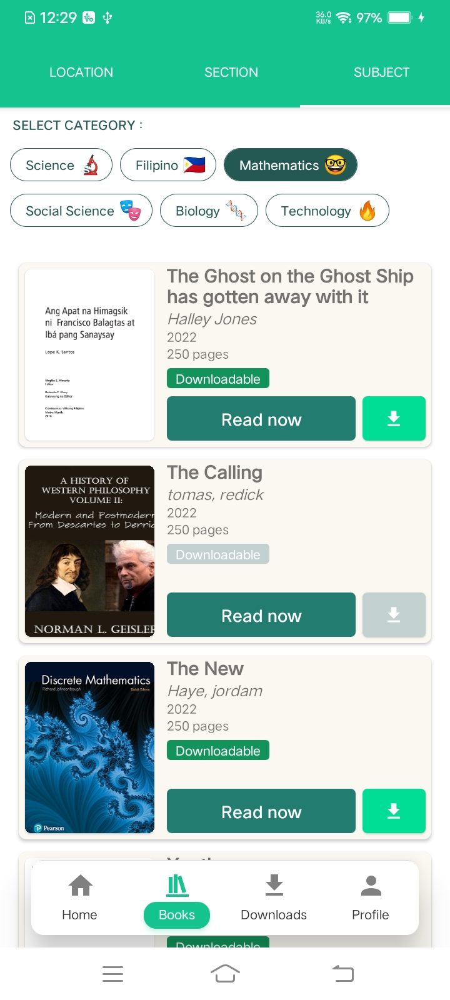

# eLibrary-app
## A react native project.
It is a pdf reader app.
It includes user authentication via email and password with firebase .
It can Download pdf for offline reading or read directly.
It can search books title, author and year of publication.
It can browse books by category.
Has an option to scroll a pdf, either horizontal mode or vertical mode. 

#### note : I did not test it on ios. I only used physical android device in developing it.

### Login

### Home

### Download

### Category

